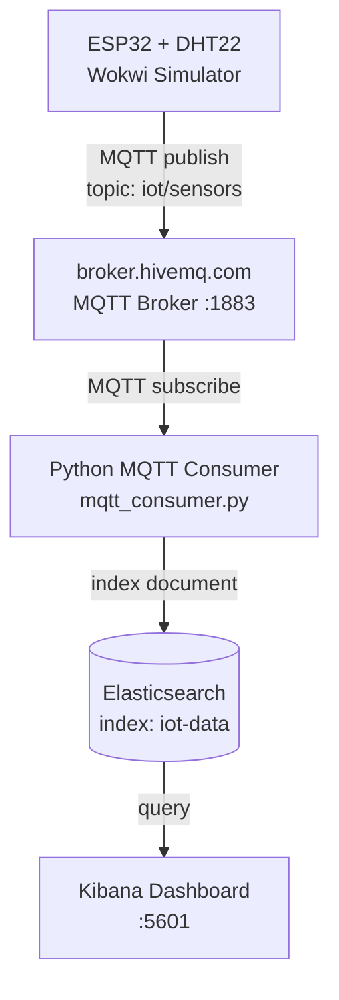

# IoT Monitoring Platform

Academic IoT monitoring platform built with a simulated **ESP32 + DHT22** sensor node (Wokwi), **MQTT** (HiveMQ public broker), a **Python** consumer, **Elasticsearch** for storage, and **Kibana** for visualization.

## 1. Project Description

This project simulates an environmental monitoring station. A virtual ESP32 board (running in the Wokwi simulator) reads temperature/humidity (DHT22), motion (PIR), gas concentration (MQ2) and ambient light (LDR) every 5 seconds and publishes the combined readings as JSON over MQTT to the public broker `broker.hivemq.com`. A local LED + buzzer give immediate on-board feedback when a threshold is crossed. A Python consumer subscribes to the MQTT topic, timestamps and analyzes each reading for anomalies, and persists it into Elasticsearch. Kibana is used to build real-time dashboards on top of the stored data.

## 2. Architecture



| Layer | Technology |
|---|---|
| Sensor node | ESP32 DevKit V1 + DHT22, PIR, MQ2 gas sensor, LDR (Wokwi simulation) |
| Local actuators | LED + buzzer (threshold alerts on the board itself) |
| Messaging | MQTT over `broker.hivemq.com:1883` |
| Consumer | Python 3, `paho-mqtt`, `elasticsearch` client |
| Storage | Elasticsearch 8.x |
| Visualization | Kibana 8.x |
| Orchestration | Docker Compose |

## 3. Project Structure

```
iot-monitoring/
│
├── docker-compose.yml
│
├── esp32/
│   ├── sketch.ino
│   ├── diagram.json
│   └── libraries.txt
│
├── consumer/
│   ├── mqtt_consumer.py
│   ├── config.py
│   └── requirements.txt
│
├── elasticsearch/
│   └── init_index.json
│
└── README.md
```

## 4. Installation Steps

### Prerequisites
- Docker Desktop (with Docker Compose)
- Python 3.9+
- A free [Wokwi](https://wokwi.com) account (or VS Code Wokwi extension) to run the ESP32 simulation

### Clone / open the project
Open the `iot-monitoring/` folder in VS Code or your terminal of choice.

## 5. Docker Commands

Start Elasticsearch and Kibana:

```bash
cd iot-monitoring
docker compose up -d
```

Check the containers are running:

```bash
docker compose ps
```

View logs:

```bash
docker compose logs -f elasticsearch
docker compose logs -f kibana
```

Stop the stack:

```bash
docker compose down
```

Stop and remove all stored data (volumes):

```bash
docker compose down -v
```

## 6. Running the Consumer

Install dependencies (preferably in a virtual environment):

```bash
cd consumer
python -m venv venv
venv\Scripts\activate        # Windows
# source venv/bin/activate   # Linux/Mac
pip install -r requirements.txt
```

Run the consumer (Elasticsearch must already be up):

```bash
python mqtt_consumer.py
```

Expected terminal output:

```
2026-09-07 10:00:00 [INFO] Connected to MQTT broker broker.hivemq.com:1883
2026-09-07 10:00:00 [INFO] Subscribed to topic 'iot/sensors'
2026-09-07 10:00:05 [INFO] Stored reading | device=esp32-01 temp=28.5 humidity=60.0 anomaly=False
2026-09-07 10:00:10 [WARNING] ANOMALY DETECTED | device=esp32-01 temperature=36.2 humidity=61.0
```

## 7. Importing the Wokwi Project

1. Go to [wokwi.com](https://wokwi.com) and create a new **ESP32** project (or open the Wokwi extension in VS Code).
2. Replace the generated `sketch.ino` with [esp32/sketch.ino](esp32/sketch.ino).
3. Replace/import [esp32/diagram.json](esp32/diagram.json) as the wiring diagram. It wires up:
   - **DHT22** (temperature/humidity) on GPIO 4
   - **PIR motion sensor** (OUT) on GPIO 13
   - **MQ2 gas sensor** (AOUT/DOUT) on GPIO 34/27
   - **Photoresistor (LDR)** (AO) on GPIO 35
   - **Alert LED** (through a 220 ohm resistor) on GPIO 25 and **buzzer** on GPIO 26
4. Install the libraries listed in [esp32/libraries.txt](esp32/libraries.txt) via **Library Manager** (Wokwi auto-resolves most of them; for the VS Code Wokwi extension, add them to your `libraries` list in `wokwi.toml` or install via Arduino IDE if compiling locally).
5. Click **Start Simulation**. The serial monitor will show WiFi connection, MQTT connection, and published JSON payloads every 5 seconds. Click the PIR sensor and choose "Simulate Motion" to trigger motion detection, and drag the gas sensor/photoresistor sliders to change their readings; the on-board LED/buzzer light up whenever a threshold is crossed.

## 8. Elasticsearch Verification

Check cluster health:

```bash
curl http://localhost:9200/_cluster/health?pretty
```

Check the index was created:

```bash
curl http://localhost:9200/iot-data?pretty
```

Query the stored documents:

```bash
curl http://localhost:9200/iot-data/_search?pretty
```

Count anomalies:

```bash
curl -X GET "http://localhost:9200/iot-data/_count?pretty" -H "Content-Type: application/json" -d "{\"query\": {\"term\": {\"anomaly\": true}}}"
```

## 9. Kibana Configuration

1. Open Kibana at [http://localhost:5601](http://localhost:5601).
2. Go to **Stack Management > Data Views** (or **Index Patterns**) and create a data view:
   - Name/pattern: `iot-data`
   - Timestamp field: `timestamp`
3. Go to **Discover** to confirm incoming documents appear in real time.

## 10. Dashboard Creation

Create the following visualizations in **Analytics > Visualize Library**, then combine them into a single **Dashboard** (e.g. `IoT Monitoring Dashboard`):

| Visualization | Type | Configuration |
|---|---|---|
| Current Temperature | Metric | Aggregation: Average/Last value of `temperature`, no bucket (or Top Hit sorted by `timestamp` desc) |
| Current Humidity | Metric | Aggregation: Average/Last value of `humidity`, no bucket (or Top Hit sorted by `timestamp` desc) |
| Temperature History | Line chart | X-axis: `timestamp` (date histogram), Y-axis: Average `temperature` |
| Humidity History | Line chart | X-axis: `timestamp` (date histogram), Y-axis: Average `humidity` |
| Number of Anomalies | Metric | Aggregation: Count, Filter: `anomaly: true` |

Steps for each visualization:
1. **Analytics > Visualize Library > Create visualization**.
2. Choose the visualization type (Metric / Lens Line chart).
3. Select the `iot-data` data view.
4. Configure the field/aggregation as per the table above.
5. Save with a descriptive name.

Then:
1. **Analytics > Dashboard > Create dashboard**.
2. **Add from library** and select all 5 visualizations.
3. Arrange the panels and set the auto-refresh interval (e.g. every 5 seconds) to view live data.
4. Save the dashboard as `IoT Monitoring Dashboard`.

## 11. Expected Screenshots for Report

For the academic report, capture:
1. Wokwi simulation running with serial monitor showing published JSON payloads.
2. Terminal output of `mqtt_consumer.py` showing stored readings and anomaly warnings.
3. Elasticsearch `_search` query result (via curl or browser) showing stored documents.
4. Kibana Data View creation screen.
5. Kibana Discover view showing live `iot-data` documents.
6. Final Kibana Dashboard with all 5 panels (current temperature, current humidity, temperature history, humidity history, number of anomalies).

## 12. Academic Deliverables

### 12.1 Architecture Explanation
The system follows a linear IoT data pipeline. The ESP32 (simulated in Wokwi) acts as the edge device, periodically sampling a DHT22 sensor and publishing structured JSON messages over MQTT — a lightweight publish/subscribe protocol suited for constrained IoT devices. The public broker `broker.hivemq.com` decouples the producer (ESP32) from the consumer (Python script), removing the need for a direct network link between them. The Python consumer acts as the bridge between the messaging layer and the persistence layer: it subscribes to the topic, enriches each message with a server-side timestamp (since the ESP32 has no reliable real-time clock), applies simple threshold-based anomaly detection, and indexes the resulting document into Elasticsearch, a distributed search and analytics engine. Kibana, bundled with Elasticsearch, provides the visualization layer, querying the `iot-data` index to render real-time metrics and historical trends.

### 12.2 Objectives
- Simulate a realistic IoT sensor node without physical hardware, using Wokwi.
- Demonstrate an end-to-end MQTT-based telemetry pipeline.
- Apply basic real-time anomaly detection on streaming sensor data.
- Persist and query time-series IoT data using Elasticsearch.
- Build interactive, real-time monitoring dashboards using Kibana.
- Containerize the storage/visualization stack for reproducible deployment.

### 12.3 Functionalities
- Periodic (5s) sampling of temperature/humidity (DHT22), motion (PIR), gas concentration (MQ2) and ambient light (LDR) on a simulated ESP32.
- Local, on-board alerting: LED + buzzer activate immediately when a threshold is crossed, independent of the network.
- MQTT publishing of structured JSON telemetry over a public broker.
- MQTT subscription and message parsing in Python.
- Server-side timestamping of every reading.
- Threshold-based anomaly detection (temperature > 35°C, humidity > 80%, gas > 1000 ppm or MQ2 digital alert).
- Terminal logging of anomalies for operational monitoring.
- Automatic Elasticsearch index creation and document indexing.
- Kibana dashboards for live and historical visualization.

### 12.4 Technologies Used
- **Wokwi**: browser-based IoT hardware simulator (ESP32, DHT22, PIR, MQ2, LDR).
- **Arduino/C++**: firmware for the ESP32 (WiFi, PubSubClient, DHT, ArduinoJson).
- **MQTT** (`broker.hivemq.com`): lightweight publish/subscribe messaging protocol.
- **Python 3** (`paho-mqtt`, `elasticsearch`): MQTT consumer and data processing.
- **Elasticsearch 8.x**: NoSQL document store and search/analytics engine.
- **Kibana 8.x**: data visualization and dashboarding tool.
- **Docker Compose**: local orchestration of Elasticsearch and Kibana.

### 12.5 Conclusion
This project demonstrates a complete, reproducible IoT monitoring pipeline, from simulated edge sensing to real-time dashboarding, using only free/open tools and a public MQTT broker. It illustrates core IoT concepts (edge sampling, publish/subscribe messaging, stream processing, anomaly detection, and data visualization) in a form suitable for academic study and further extension — for example, replacing the public broker with a private one secured by TLS/authentication, adding more sensors, or introducing machine-learning-based anomaly detection in place of static thresholds.
